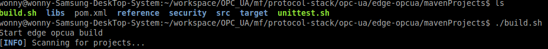
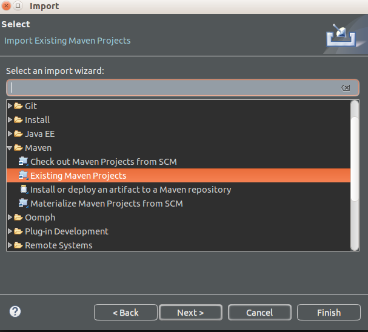
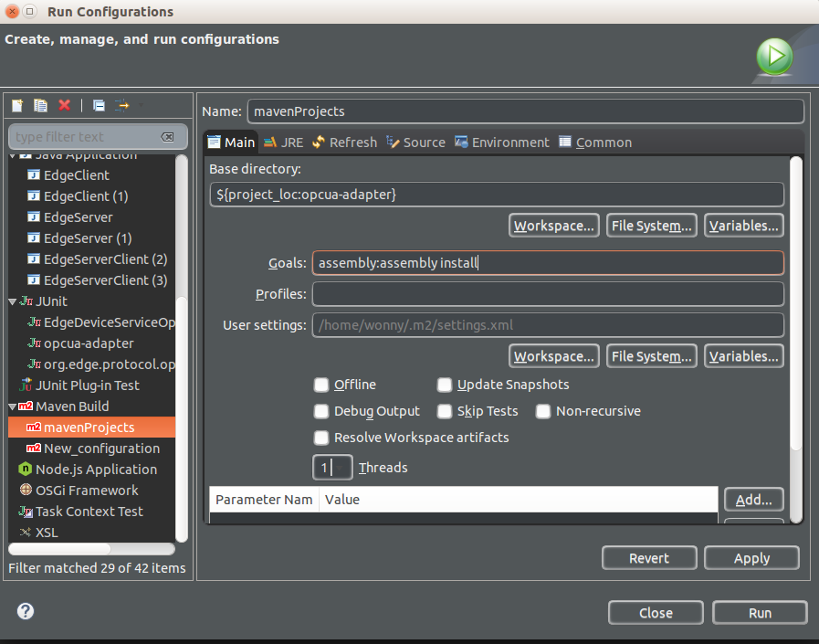

# OPC-UA library

## Pre-Requirements to build opcua library

### JDK 1.8
1. Intall JDK v1.8

   Install Guide : https://docs.oracle.com/javase/8/docs/technotes/guides/install/linux_jdk.html

2. Eclipse Setting
   
   Select Project -> Preference - Java Build Path - JRE System Library -Edit
     -> Installed JREs - Add - Standard VM - Next - input Path installed JDK 1.8
     -> finish
  
### maven
1. Install maven v3.5.2

   Download : https://maven.apache.org/download.cgi
   
   Install Guide : https://maven.apache.org/install.html
  
## How to build OPC-UA library with Maven

1. Environment : Ubuntu 16.04 (64bit)

2. Run ./build.sh in command line in *protocol-stack/opc-ua/edge-opcua/mavenProjects*

   
  
## How to build OPC-UA library with Eclipse

1. import opcua stack project(*protocol-stack/opc-ua/edge-opcua/mavenProjects*)

   

2. Select Project -> Click Right button 

3. Run As -> Run Configurations

4. insert goal : assembly:assembly install

   

5. Run As -> Maven Build 

6. you can find 'opcua-adapter-0.0.1-SNAPSHOT-jar-with-dependencies.jar' in /target forlder
  

#### Test OPC-UA sample application [here](../example/README.md)
